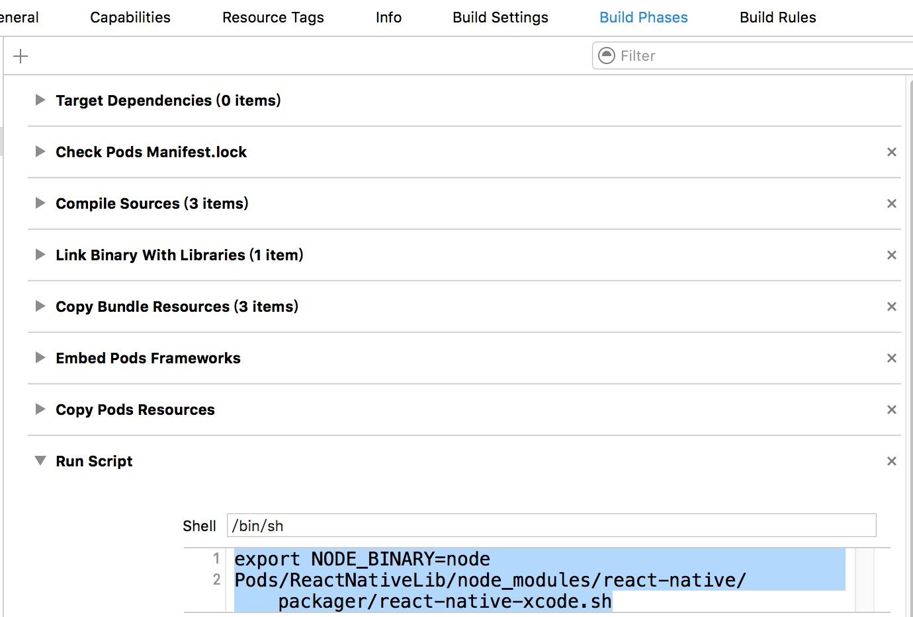
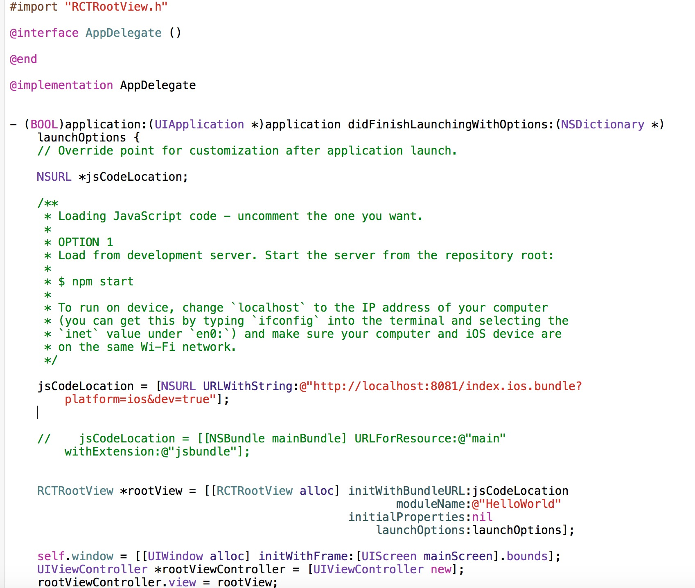
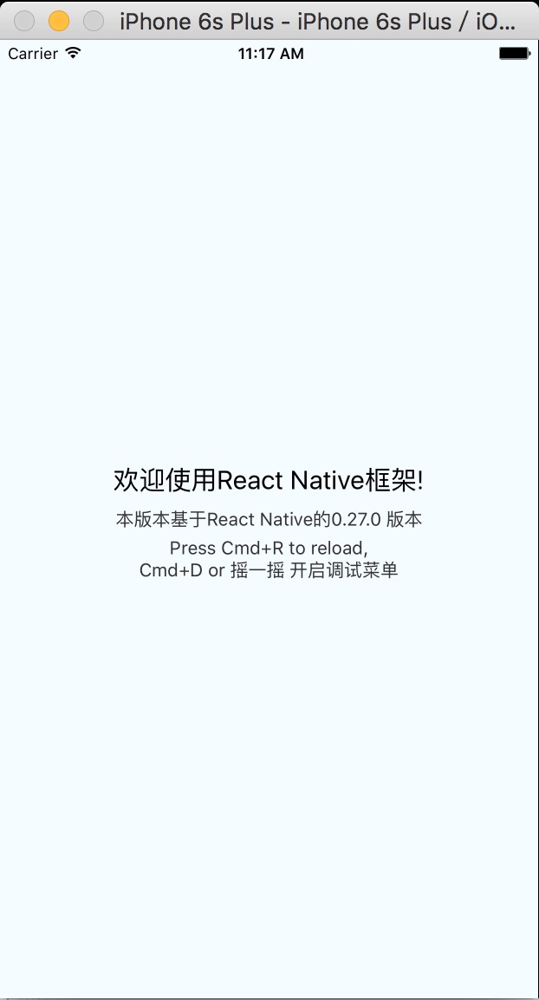

# 在已有iOS使用的Cocoapods框架 嵌入React Native

 对于已有iOS工程嵌入React Native的Framework 网上有很多教程，但是你会发现发现，迁移成本或者要做的事情太多，我花了些时间看了下，整理到最少的步骤去继承，大大节省了布置环境的时间，毕竟“代码搬运工们”还是要把大量的时间用在写Bug上~~
 
 废话少说，该版本是基于React Native的0.27.0 版本。
 请认真阅读以下操作步骤，如有错误，概不负责~

 1.在Podfile 代码里中添加
 ` pod "ReactNativeLib", :git => 'git@code.wepiao.com:doujingxuan/ReactNativeFramework.git', :branch => '0.27.0'`
 
 2.`cd` 到 `Pods/ReactNativeLib` 目录下 将`build.sh` 添加可执行权限 `chomd +x build.sh`
 
 3.在Xcode中打开要执行的Target 在`Build Phases`添加一下代码
 `export NODE_BINARY=node
Pods/ReactNativeLib/node_modules/react-native/packager/react-native-xcode.sh`

4.需要将现在跑的项目中 至少保证一个文件是以`.mm` 结尾 推荐`AppDelete.mm`

5.以`AppDelegate.mm` 为例 新建一个`RCTRootView` 代码如下：

6.iOS9 之后默认开启https服务 由于node 本地开启的package是http协议，所以如果想在调试阶段方便调试，便需要在plist中

7.打开`.xcodeworkspace`,选中目标target,点击Run 即可看到以下界面

此脚本会持续维护，越来越智能的去服务开发者~